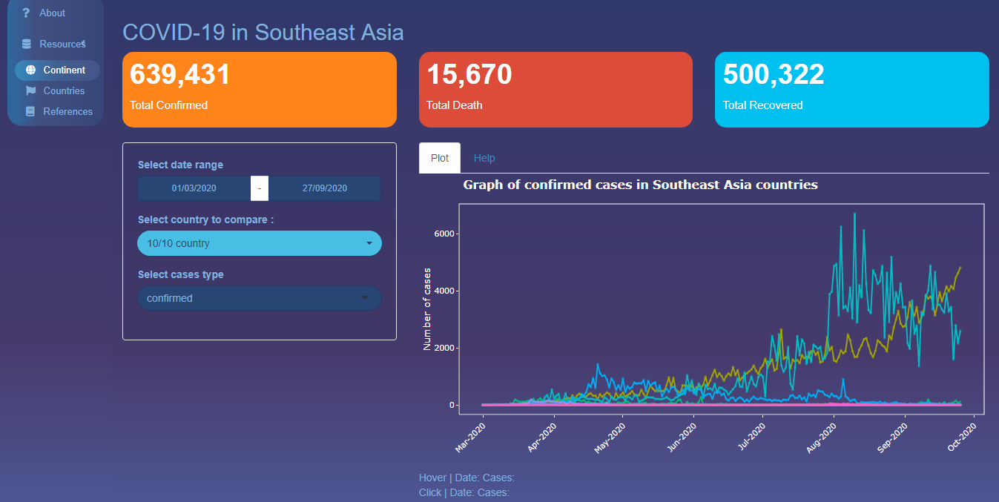
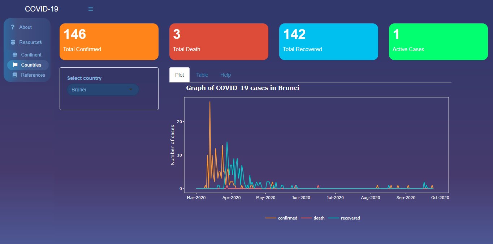

<style>
body {
text-align: justify}
</style>

```{r setup, include=FALSE}
knitr::opts_chunk$set(echo = FALSE, fig.pos = "center", options(scipen=999))
```

```{r, include=FALSE, warning=FALSE, message=FALSE}
library(tidyverse)
library(ggplot2)
library(lubridate)
library(coronavirus) # update_dataset()
library(htmltools)
library(plotly)
```

# The Covid-19 Shiny app

An application to explore the development of coronavirus in South East Asia countries. There are two graph in this application.
You can check the apps from this link.

[Covid Shiny app on GithUb](https://github.com/etc5523-2020/shiny-assessment-whysptra)

In the continent tab, you can see the graph for daily cases in all South East Asia
In the countries tab, there are graph for every representative country in South East Asia.

Both graph represented by the day, countries, type of cases, and number of each representative cases.

Data sources : All the data comes from [`coronavirus`](https://github.com/RamiKrispin/coronavirus) dataset from CRAN.

### Tab : Continent


In this tab, there is a line graph showing the progress of cases in all South East Asia countries. The x-axis shows the date, while the y-axis shows the number of cases.
Each line represents one country.
The features available in the sidebar are :
* Date range: date range from 01/03/2020 to 27/09/2020. When pressing this field, a calendar will appear to select the minimum and maximum date ranges as desired. The graph will adjust according to the selected date.
* Country selection: contains ten countries that can be selected multiple times. This feature can be used to compare one country to another.
* Type of cases: There are three types of cases, namely confirmed, death, and recovered. Can only select one case to visualize.
* ValueBox shows the total of each case according to the Date Range and Country options.

At the bottom there is Hover Data and Click Data. Hover data will show the date and number of cases dynamically when the cursor hover the line graph. Meanwhile, Click Data will show the date data and the number of cases at a point when the line graph is clicked.

This section useful when you want to compare the number of one individual cases in multiple country.

### Tab : Countries


In this tab, there is a line graph showing the progress of cases in one country. On the x-axis it shows the date, while on the y-axis it shows the number of cases.
Each line represents the type of case (confirmed, death, and recovered).
The features available on the sidebar are:
- Country selection: contains ten countries which can only be selected once.
- Interactive Table: shows the country's daily case data. The table will change according to the country selection.
- ValueBox shows the total of each case and active cases according to the Country selection.

This section can be used to compare the number of all cases in a country.

# Self Review

– What did you do well?
> This application can show comparisons of cases in each country as well as comparisons of other countries. The addition of interactive features such as the Date Range and Case type button allows users to explore further the development of the coronavirus case. I chose a theme from shinydashboardtheme because it has a complete and attractive theme library. Using plotly without limitation Bar Mode makes users focus more on the graphic without display clutter. In my opinion, the addition of the ValueBox feature helps users to get instant summaries when viewing charts with the input they want. Using interactive tables also allows users to find a case on a particular day with the filter or search feature. In essence, this application focuses on the goal of displaying the development of coronavirus data in Southeast Asia with an attractive, simple, and easy to use appearance.

– What are the points you can improve on?
> Some of the things I can improve from this application are:
> From the graph on the continents tab, there is data hover and click data based on event_data (plotly_hover & plotly_click). In this feature, it displays data when plotly was hovered and clicked at a particular point. However, the data only shows the date and number of cases on that date. The improvement that can be done by adding information on the country where the cases occurred so that it makes it more evident for users to get the information.

– What are some things that you’d like to add that’s plausible?
> Adding a choropleth map from Southeast Asia can be an additional feature to see the visualization of total cases in each country.
> Whether only displays hover and click in text form, and it will be more informative if it shows a table of the data in question, complete with country, date, type of case, and the number of cases on that day.
> Need to add Active cases value box to the continents tab to be similar to the Countries tab.

– What are some things that you’d like to add that cannot be done yet due to limitation in data or technology?
> I would like to add an option of the number of daily tests for each country. Thus, it can show a correlation between the number of tests performed and the rate at which a country detects cases.
> Since the dataset does not contain the profiles of each patient, it would be exciting to have data on the age of each patient so that I can make a comparison chart of the age groups from children to adults from each country.

# Acknowledgements

This blog post constructed by R functions from packages as following:
- distill @distill
- tidyverse @tidyverse2
- ggplot2 @ggplot2
- lubridate @lubridate
- htmltools @htmltools
- plotly @plotly